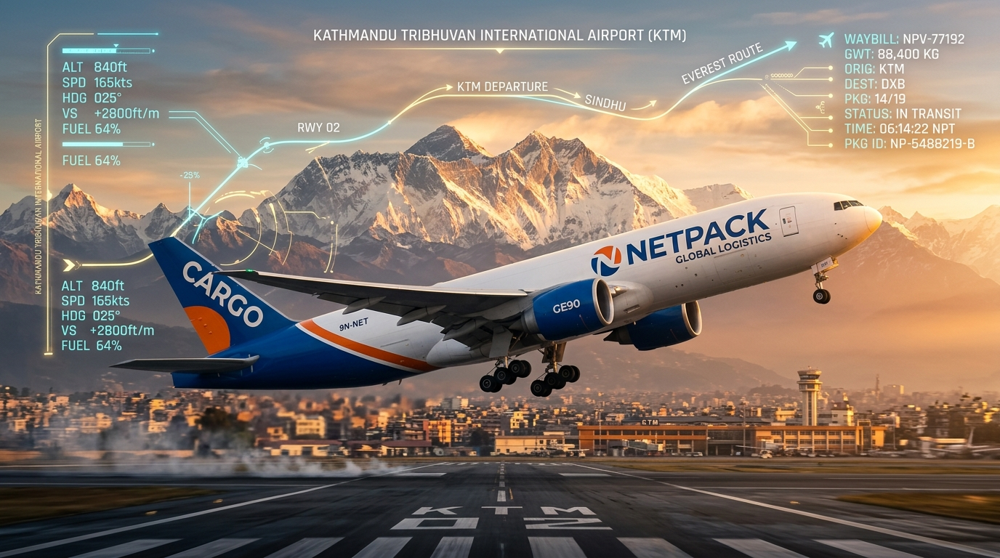
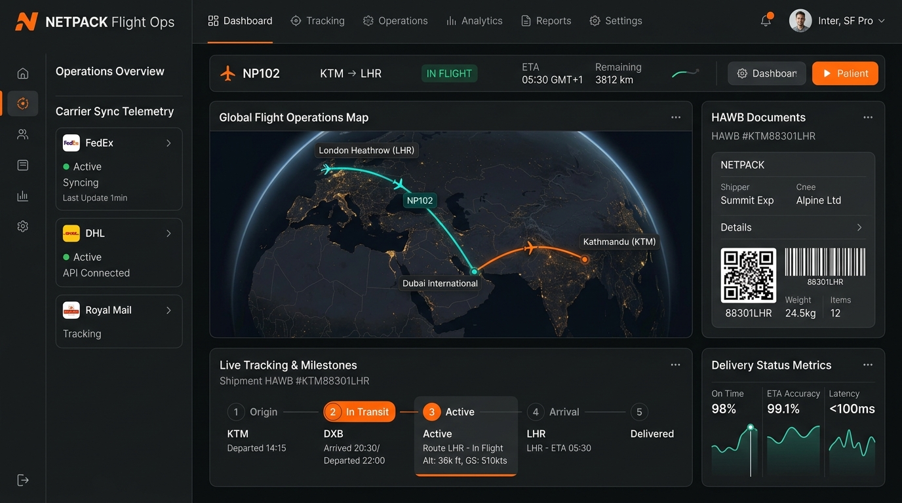
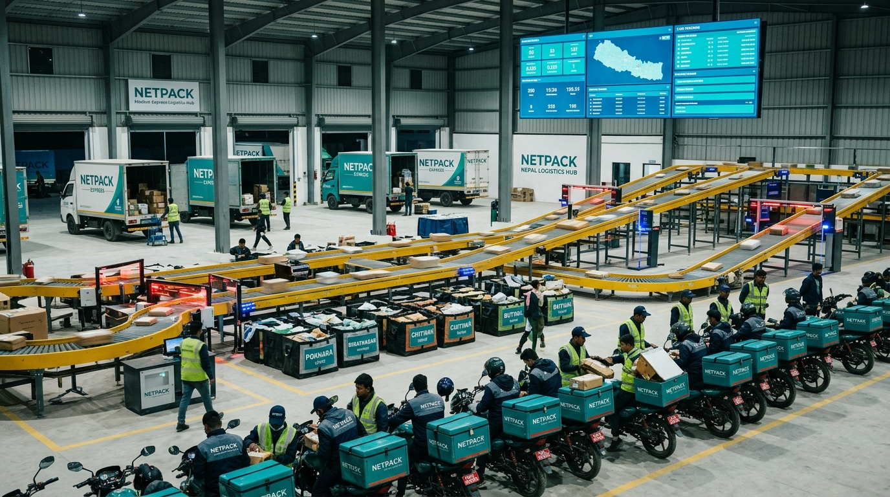
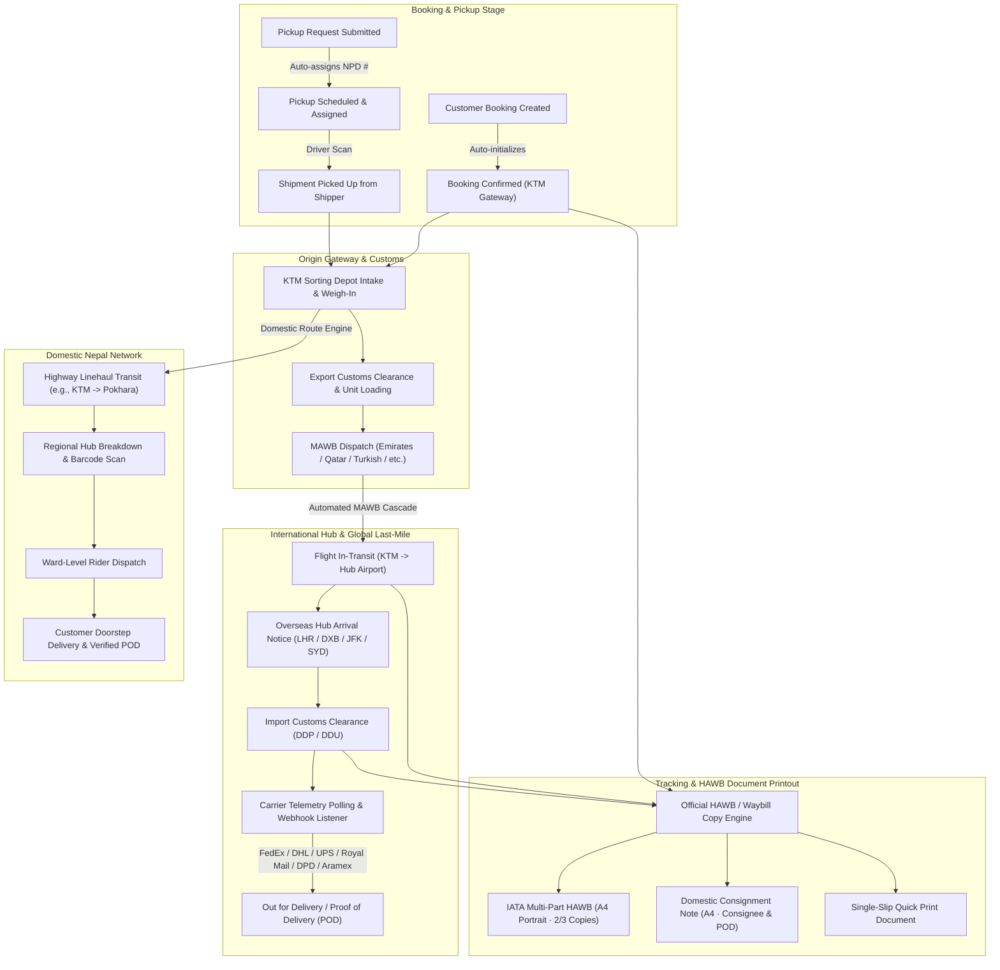

# COURIER with NETPACK &middot; Enterprise Platform

[](NETPACK_SYSTEM_README_DOCUMENTATION.pdf)
[](tests/)
[](https://laravel.com)

**COURIER with NETPACK** is an enterprise-grade courier and freight management platform engineered for **International Air Cargo (Hub/Agency system)**, **Nepal Domestic Express across 7 Provinces and 77 Districts**, and **E-Commerce Last-Mile delivery with live rider tracking and instant COD settlement**.

> 📄 **Official PDF Documentation Available**: A complete, publication-grade documentation manual with flowcharts, system pictures, schema dictionaries, and operational runbooks is compiled and available at **[`NETPACK_SYSTEM_README_DOCUMENTATION.pdf`](NETPACK_SYSTEM_README_DOCUMENTATION.pdf)**.

---

## 1. System Pictures & Operational Centers

### International Air Cargo Operations

*Figure 1.0: NETPACK International Air Cargo Flight taking off from Kathmandu Tribhuvan Gateway (KTM) connecting with Global Aviation Corridors (DXB, LHR, JFK, SYD).*

### Operations Control Center & Tracking Radar

*Figure 2.0: Operations Control Center showing live flight corridor trajectories (KTM &rarr; DXB &rarr; LHR), carrier sync telemetries (FedEx, DHL, Royal Mail), and automated HAWB generation.*

### Nepal Domestic Express Sorting Depot

*Figure 3.0: Nepal Central Sorting Hub & Distribution Depot with automated parcel conveyor sorting, provincial highway linehauls, and electric rider fleet.*

---

## 2. End-to-End System Flowchart



---

## 3. Technology Stack

- **Runtime**: PHP 8.3+
- **Application Framework**: Laravel 12.x
- **Database**: MariaDB 10.4+ or MySQL 8.0
- **Frontend**: Blade, Tailwind CSS, Vanilla JavaScript, Vite
- **Geospatial Radar**: Leaflet.js with OpenStreetMap flight curves and provincial highway bounds
- **Barcodes & QR**: Endroid QR Code v6 & Milon Barcode v13
- **PDF Engine**: Barryvdh Laravel DomPDF (multi-part A4 HAWBs, manifests, POD consignment notes)
- **Queues & Scheduling**: Laravel Queue Workers & Artisan Cron Daemon

---

## 4. Operational Portals & Role Matrix

The platform enforces strict role-based access control (RBAC) across 10 distinct user types:

| Role | Default Portal | Operational Scope |
|---|---|---|
| **Super Admin** | `/admin/dashboard` | Platform-wide oversight, rate matrices, packaging catalogs, and staff management. |
| **International Admin** | `/international/dashboard` | Air cargo rates, overseas hubs, agency formats, MAWB flight assignments, and manifests. |
| **Domestic Admin** | `/domestic/dashboard` | 77-district hubs, highway linehaul routes, scan desk audits, and delivery SLA reminders. |
| **Operations Staff** | `/domestic/dashboard` | Depot intake, scale weigh-in verification, barcode bag scans, and vehicle loading. |
| **Overseas Partner** | `/overseas/dashboard` | Overseas hub arrival notice processing (whole/partial), customs breakdown, and carrier handoffs. |
| **Domestic Partner** | `/partner/dashboard` | District depot operations (e.g. Pokhara, Biratnagar, Chitwan), bag reception, and rider dispatch. |
| **Delivery Rider** | `/rider/dashboard` | Mobile runsheet, doorstep ward delivery, photo/signature POD, and instant COD collection. |
| **E-Commerce Seller** | `/seller/dashboard` | Bulk order uploads, shipping label printing, live dispatch status, and COD payouts. |
| **Business Client** | `/client/dashboard` | Active shipment radar, bulk rate inquiry calculator, HAWB copies repository, and billing. |
| **Public User** | `/tracking/{number}` | Universal tracking lookup, milestone alert subscription, and 1-click HAWB printing. |

---

## 5. Local Installation & Quickstart

Requirements: PHP 8.3, Composer 2, Node.js 20+, npm, and MariaDB/MySQL.

```bash
git clone https://github.com/kirannetpack-ui/COURIER-by-NETPACK.git
cd COURIER-by-NETPACK
composer install
npm install
copy .env.example .env
php artisan key:generate
```

Configure your local database in `.env` (`DB_DATABASE=netpack_db`), then execute:

```bash
php artisan migrate:fresh --seed
npm run build
php artisan serve
```

### Local Demo Accounts (Seed Environment Only)

| Role | Email | Temporary Password |
|---|---|---|
| Super Administrator | `superadmin@netpack.test` | `Netpack!Admin#2026` |
| Domestic Administrator | `domestic.admin@netpack.test` | `Netpack!Domestic#2026` |
| International Administrator | `international.admin@netpack.test` | `Netpack!International#2026` |
| Operations Staff | `staff@netpack.test` | `Netpack!Staff#2026` |
| Domestic Partner | `partner@netpack.test` | `Netpack!Partner#2026` |
| Overseas Partner | `overseas@netpack.test` | `Netpack!Overseas#2026` |
| E-Commerce Seller | `seller@netpack.test` | `Netpack!Seller#2026` |
| Delivery Rider | `rider@netpack.test` | `Netpack!Rider#2026` |
| Customer | `customer@netpack.test` | `Netpack!Customer#2026` |
| Business Client | `client@netpack.test` | `Netpack!Client#2026` |

---

## 6. International Air Cargo & Hub/Agency Engine

### Master Air Waybill (MAWB) Cascades
Updating a Master Air Waybill (MAWB) automatically propagates events to all bundled child consignments:
- `in_transit`: Assigns `in_transit_airline` milestone with airline name, flight number, origin KTM, and destination hub.
- `cleared`: Assigns `customs_cleared` at destination gateway.
- `completed`: Assigns `hub_received` at overseas facility for last-mile carrier handover.

### Tier-1 Global Carrier Telemetry Sync
- **Webhook Listener**: `POST /api/webhooks/carrier-tracking/{carrier}` accepts telemetry from **FedEx**, **DHL Express**, **UPS**, **Royal Mail**, **Australia Post**, **DPD Group**, and **Aramex**.
- **Artisan Polling Daemon**: `php artisan tracking:sync-carriers` polls active consignments every 15 minutes.

---

## 7. Nepal Domestic Logistics (7 Provinces & 77 Districts)

- **Provincial Corridors**: Covers Koshi (Province 1), Madhesh (Province 2), Bagmati (Province 3), Gandaki (Province 4), Lumbini (Province 5), Karnali (Province 6), and Sudurpashchim (Province 7).
- **Consolidated Manifest Bags**: Packages are sealed in nylon bags tagged with unique QR codes. Stamping a bag as arrived at a regional hub automatically updates all enclosed shipments atomically.
- **Scan Desk**: Operators process barcodes at `/domestic/manifests/scan` with action buttons for `arrival`, `dispatch`, and `delivery`.
- **Rider POD**: Ward riders capture digital recipient signature and delivery photos.

---

## 8. Universal HAWB Document Generator & 1-Click Printouts

Every tracked shipment provides instant access to official non-monetary freight documentation with strict zero-charges compliance:

- **International HAWB (A4 Multi-Part)**: `GET /tracking/{number}/hawb` renders standard IATA multi-part copies (Consignee Copy, Customs/Operations Copy, Carrier Copy) with routing codes, weight verification, and tracking QR code.
- **Domestic Waybill / Consignment Note**: Renders runsheet and POD carrier copies with Nepal highway route points and destination ward tags.
- **Single-Slip Quick Print**: `GET /tracking/{number}/hawb/print` formats compact slips for thermal and warehouse label printers.

---

## 9. Automated Testing & Verification Suite

Execute the comprehensive test suite validating route integrity, role authorization, MAWB cascades, HAWB printability, and multi-carrier webhooks:

```bash
php artisan test
```

### Verification Metrics
- **Feature & Unit Tests**: **111 Passed (100% Success Rate)**
- **Test Assertions**: **771 Assertions**
- **Test Failures**: **0**

---

## 10. Generating the PDF Documentation

To regenerate the publication-grade PDF documentation manual:

```bash
php generate_readme_pdf.php
```

The output file is saved to **`NETPACK_SYSTEM_README_DOCUMENTATION.pdf`** in the repository root.
